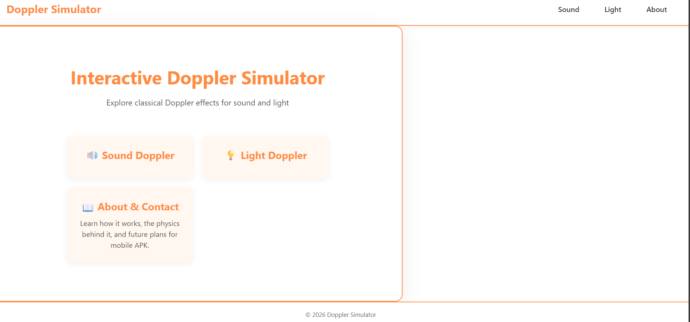
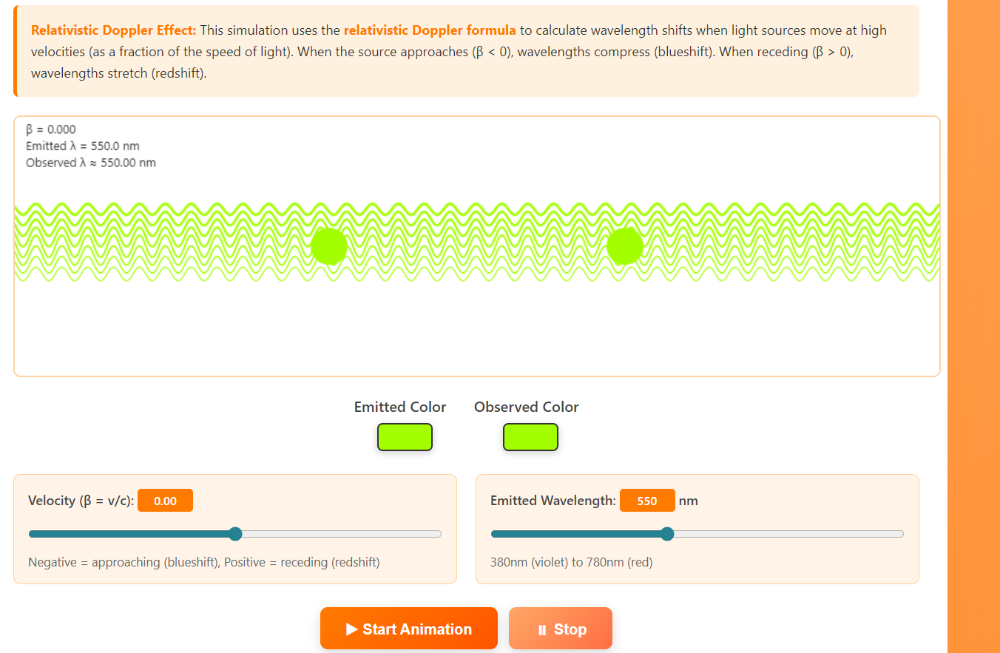
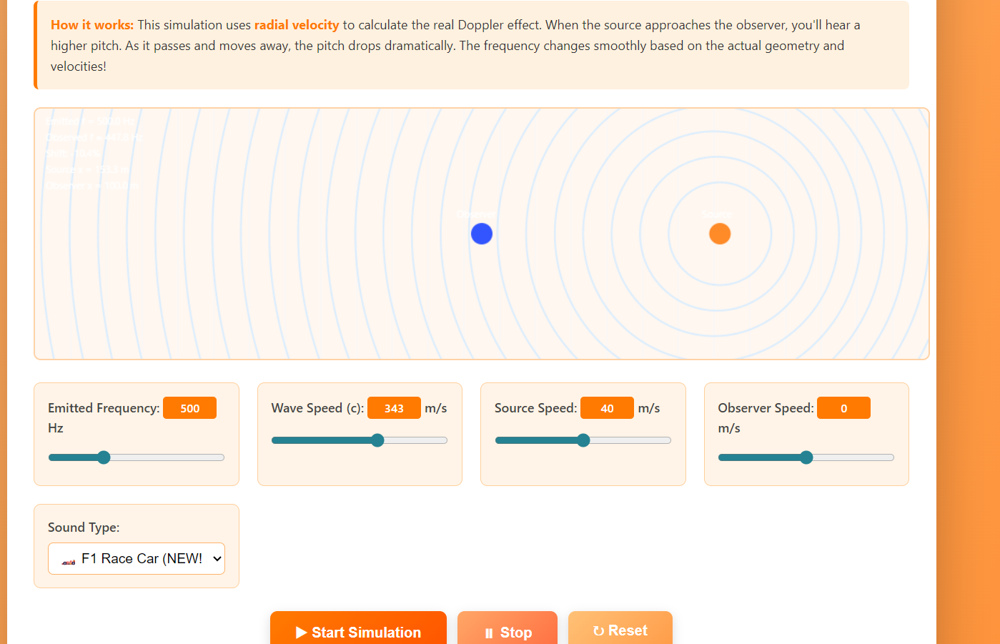
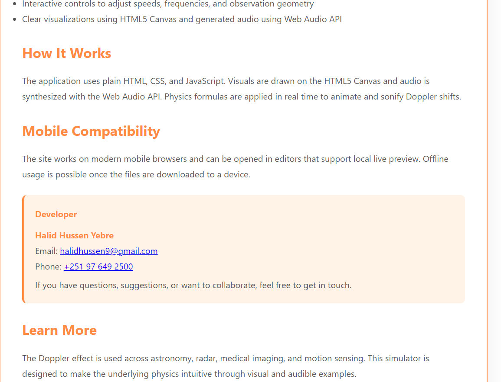

# **Doppler Effect Simulator**  

**Doppler Effect Simulator** is an interactive physics project that demonstrates both the **sound and light Doppler effect**. It helps students and enthusiasts **visualize and understand how frequency and wavelength change** when sources move relative to an observer. This simulator offers a **realistic, hands-on experience** with generated audio and real-time visualizations.  

---

## **Table of Contents**
1. [Overview](#overview)  
2. [Features](#features)  
3. [Installation](#installation)  
4. [Usage](#usage)  
5. [Screenshots](#screenshots)  
6. [Contributing](#contributing)  
7. [License](#license)  
8. [Acknowledgements](#acknowledgements)  

---

## **Overview**  
The **Doppler Effect Simulator** allows users to explore:  
- How sound frequency changes as a source approaches or moves away (sound Doppler effect)  
- How light wavelength shifts at high velocities (relativistic light Doppler effect)  

Built entirely with **HTML, CSS, and JavaScript**, it runs fully in the browser without any external frameworks.  

**Goals:**  
- **Visual Learning:** Provide interactive visualizations of Doppler phenomena  
- **Audio Experience:** Hear realistic frequency shifts for vehicles and tones  
- **Educational Tool:** Help students grasp abstract physics concepts in an intuitive way  

---

## **Features**  
- **Sound Doppler Simulator:** Real-time pitch change with multiple sound modes (car, train, helicopter, pure tone)  
- **Light Doppler Simulator:** Wavelength shifts with visual color changes (blueshift/redshift)  
- **Responsive UI:** Clean interface optimized for desktop and mobile  
- **Customizable Settings:** Adjust velocities, wavelengths, and frequencies  
- **Real-Time Calculations:** Physics formulas applied live without pre-recorded files  

---

## **Installation**  

### **Prerequisites**
- Modern web browser (Chrome, Edge, Firefox, etc.)  
- Optional: Live Server plugin if you want to run locally with auto-refresh  

git clone https://github.com/YourUsername/doppler-effect-simulator.git
- ## Screenshots

### Home Page

### Light Doppler Effect Page

### Sound Doppler Effect Page

### About Page

